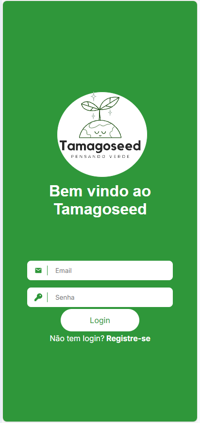
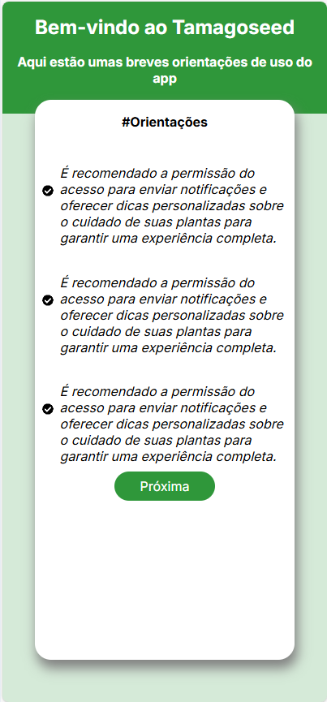
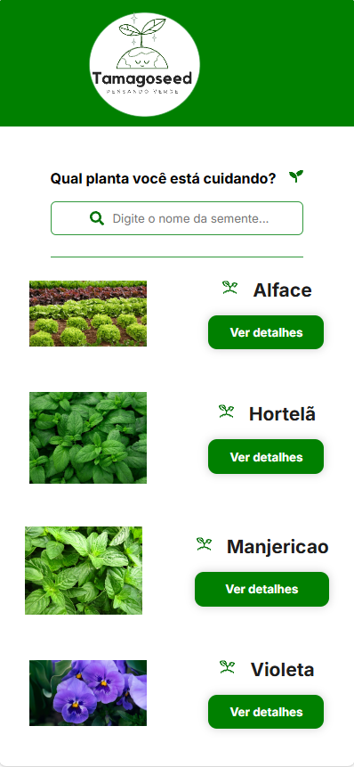
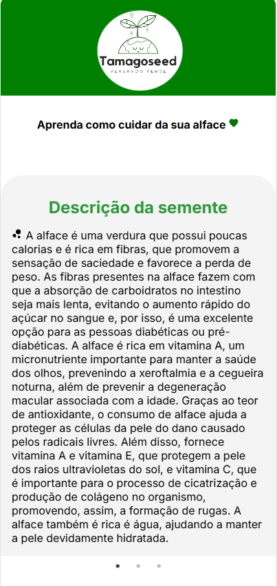

# Projeto Florzinha

Bem-vindo ao **Projeto Florzinha**! Este é um aplicativo projetado para te ajudar a cuidar das suas plantas. 

## Como Funciona

O aplicativo é dividido em duas partes principais:

1. **Frontend**: A interface do usuário onde você pode interagir com o aplicativo e visualizar as plantas.
2. **API**: A parte do backend que gerencia as informações das plantas e as interações com o frontend.

### Frontend

No frontend, você terá acesso a uma interface amigável onde poderá:

- Realizar o login ou se cadastrar.
- Instruções de como cuidar de plantas.

### API

A API é responsável por:

- Receber e armazenar as informações das plantas.
- Fornecer dados para o frontend.
- Gerenciar a lógica de negócios do aplicativo.

## Capturas de Tela

Aqui estão algumas capturas de tela do aplicativo para te dar uma ideia de como ele se parece:

*Tela principal do aplicativo.*

*Tela de bem vindo.*

*Tela de busca do aplicativo.*

*Detalhes de uma planta específica.*

## Suporte

Se tiver dúvidas ou problemas, pergunte ao responsável pelo projeto.

